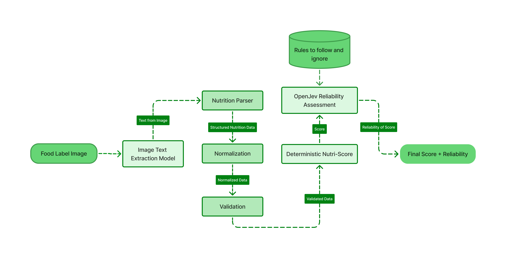

<div align="center">

# 🥗 NutriParse

### From a food-label image to structured nutrition, deterministic grading, and reliability-aware AI assessment.


**NutriParse** is an AI-assisted nutrition-label analysis pipeline that extracts nutrition information from food-label images, converts it into a canonical structured format, normalizes and validates the extracted values, computes a deterministic nutrition grade, and uses **OpenJev** to determine whether the automated result should be **TRUSTED**, **REVIEWED**, or **REJECTED**.

> **AI where interpretation is required.  
> Deterministic computation where exactness is required.**

</div>

---

## Architecture

<p align="center">
  
</p>


The implemented pipeline is:

```text
Food Label Image
        │
        ▼
PaddleOCR-VL
Image / Text Extraction
        │
        ▼
Nutrition Parser
        │
        ▼
Canonical Nutrition JSON
        │
        ▼
Normalization + Validation
        │
        ▼
Deterministic Original Nutri-Score
        │
        ├──────────────► Grade A-E
        │
        ▼
Instance-Specific Reliability Evidence
        │
        ▼
OpenJev + qwen2.5-coder:14b
        │
        ▼
TRUST / REVIEW / REJECT
        +
Model-Derived Confidence
```

Stage 4 and Stage 5 deliberately solve **different problems**:

```text
Stage 4:
"What grade does the deterministic scoring algorithm produce?"

Stage 5:
"Given the quality of this particular pipeline result,
how reliable is it?"
```

---

## Table of Contents

- [Architecture](#architecture)
- [Why NutriParse?](#why-nutriparse)
- [Key Features](#key-features)
- [Project Status](#project-status)
- [Quick Start](#quick-start)
  - [1. Clone the repository](#1-clone-the-repository)
  - [2. Create the NutriParse Python environment](#2-create-the-nutriparse-python-environment)
- [OpenJev Setup](#openjev-setup)
  - [3. Obtain OpenJev](#3-obtain-openjev)
- [Ollama Setup](#ollama-setup)
  - [4. Install Ollama](#4-install-ollama)
  - [5. Download the required model](#5-download-the-required-model)
  - [6. Optional: verify OpenJev + Ollama integration](#6-optional-verify-openjev--ollama-integration)
- [Running NutriParse](#running-nutriparse)
- [How the Pipeline Works](#how-the-pipeline-works)
  - [Stage 1 — Food Label Extraction](#stage-1--food-label-extraction)
  - [Stage 2 — Canonical Nutrition Parsing](#stage-2--canonical-nutrition-parsing)
- [Stage 3 — Normalization and Validation](#stage-3--normalization-and-validation)
- [Stage 4 — Deterministic Nutrition Scoring](#stage-4--deterministic-nutrition-scoring)
- [Why Doesn't OpenJev Calculate the Grade?](#why-doesnt-openjev-calculate-the-grade)
- [Stage 5 — OpenJev Reliability Assessment](#stage-5--openjev-reliability-assessment)
  - [OpenJev Decisions](#openjev-decisions)
- [Observed End-to-End Results](#observed-end-to-end-results)
  - [Clean Label](#clean-label)
  - [Incomplete / Unreliable Label](#incomplete--unreliable-label)
  - [Evaluation Status](#evaluation-status)
- [Generated Artifacts](#generated-artifacts)
- [Project Structure](#project-structure)
- [Testing](#testing)
- [Failure Handling](#failure-handling)
- [Reproducibility](#reproducibility)
- [Design Principles](#design-principles)
  - [1. AI for Interpretation](#1-ai-for-interpretation)
  - [2. Deterministic Code for Exact Operations](#2-deterministic-code-for-exact-operations)
  - [3. Missing Is Not Zero](#3-missing-is-not-zero)
  - [4. Grading and Reliability Are Separate](#4-grading-and-reliability-are-separate)
  - [5. Known Project Limitations Are Not Per-Image Failures](#5-known-project-limitations-are-not-per-image-failures)
- [Current Limitations](#current-limitations)
  - [FVLN information](#fvln-information)
  - [Nutri-Score scope](#nutri-score-scope)
  - [Supported category](#supported-category)
  - [Extraction confidence](#extraction-confidence)
  - [OpenJev confidence](#openjev-confidence)
- [Roadmap](#roadmap)
  - [Completed](#completed)
  - [Next](#next)
- [Planned Stage 6](#planned-stage-6)
- [FAQ](#faq)
  - [Does NutriParse implement the latest Nutri-Score algorithm?](#does-nutriparse-implement-the-latest-nutri-score-algorithm)
  - [Does OpenJev calculate the nutrition grade?](#does-openjev-calculate-the-nutrition-grade)
  - [Why not let Qwen calculate Nutri-Score directly?](#why-not-let-qwen-calculate-nutri-score-directly)
  - [Does NutriParse require a paid API?](#does-nutriparse-require-a-paid-api)
  - [What happens if Ollama is offline?](#what-happens-if-ollama-is-offline)
  - [Why is FVLN unavailable?](#why-is-fvln-unavailable)
  - [Is `0` treated as missing?](#is-0-treated-as-missing)
  - [Is OpenJev confidence guaranteed to represent correctness?](#is-openjev-confidence-guaranteed-to-represent-correctness)
- [References](#references)
- [License](#license)
- [Project Philosophy](#project-philosophy)

---

# Why NutriParse?

Reading a nutrition label is not the same as producing a dependable automated nutrition result.

A complete pipeline must handle several separate problems:

- understand visually structured food labels;
- extract numeric values reliably;
- convert OCR output into a stable schema;
- distinguish missing values from explicit zero values;
- normalize serving-based nutrition values;
- identify impossible or suspicious nutrient relationships;
- apply grading rules exactly;
- detect when an automated result should not be trusted.

NutriParse separates these responsibilities instead of asking one model to solve everything.

For example:

```text
Image understanding       → AI / vision model
Structured extraction     → deterministic parser
Normalization             → deterministic arithmetic
Validation                → deterministic checks
Nutrition scoring         → deterministic rules
Reliability assessment    → OpenJev semantic decision
```

This makes intermediate failures visible and keeps the final result auditable.

---

# Key Features

| Capability | Implementation |
|---|---|
| **Nutrition-label understanding** | PaddleOCR-VL extracts structured information from food-label images |
| **Canonical nutrition parsing** | OCR output is converted into a stable nutrition JSON schema |
| **Unit and basis normalization** | Per-serving values are normalized to a supported per-100 g / per-100 ml basis |
| **Missing-value preservation** | `null` and explicit `0` remain distinct |
| **Cross-field validation** | Detects suspicious relationships such as fiber exceeding total carbohydrate |
| **Energy consistency checks** | Compares stated calories with macronutrient-derived estimates |
| **Deterministic grading** | Implements the original/pre-2023 general-food Nutri-Score baseline |
| **Auditable scoring** | Individual negative and positive point components are preserved |
| **Reliability assessment** | OpenJev chooses `TRUST`, `REVIEW`, or `REJECT` |
| **Local inference** | OpenJev uses Ollama with `qwen2.5-coder:14b` |
| **No paid model API required** | The current Stage 5 inference path runs locally |
| **Failure isolation** | OpenJev failure does not destroy the deterministic Stage 4 result |
| **Intermediate artifacts** | Every major stage writes inspectable output |

---

# Project Status

- [x] Stage 1 — Food-label image extraction
- [x] Stage 2 — Canonical nutrition parsing
- [x] Stage 3 — Nutrition normalization
- [x] Stage 3 — Validation and consistency checks
- [x] Stage 4 — Deterministic original Nutri-Score baseline
- [x] Stage 5 — OpenJev reliability assessment
- [x] Real clean-label `TRUST` test
- [x] Real incomplete-label `REJECT` test
- [ ] Controlled end-to-end `REVIEW` test
- [ ] Stage 6 — Confidence-aware reliability handling
- [ ] Confidence-threshold calibration
- [ ] Evaluation dataset
- [ ] Quantitative end-to-end evaluation

---

# Quick Start

## 1. Clone the repository

```powershell
git clone https://github.com/Saitej2456/nutriParse
cd nutriParse
```

---

## 2. Create the NutriParse Python environment

The current project uses **Python 3.12**.

```powershell
python -m venv nutriparse-env
.\nutriparse-env\Scripts\Activate.ps1
```

Upgrade pip if needed:

```powershell
python -m pip install --upgrade pip
```

Install the NutriParse dependencies:

```powershell
python -m pip install -r requirements.txt
```

---

# OpenJev Setup

OpenJev is a separate Python project and must be installed into the Python environment that runs NutriParse.

## 3. Obtain OpenJev

Clone the OpenJev repository:

```powershell
git clone https://github.com/lookski/openjev.git
```

Move into the cloned repository:

```powershell
cd openjev
```

Make sure your NutriParse environment is still activated:

```text
(nutriparse-env)
```

Then install OpenJev in editable mode:

```powershell
python -m pip install -e .
```

The `-e` flag installs the local OpenJev source as an editable Python package.

After installation, return to the NutriParse repository:

```powershell
cd ..
```

You can verify that Python can import OpenJev with:

```powershell
python -c "import openjev; print('OpenJev import successful')"
```

---

# Ollama Setup

Stage 5 currently uses:

```text
Backend : Ollama
Model   : qwen2.5-coder:14b
```

## 4. Install Ollama

Install Ollama from:

https://ollama.com/

Make sure the Ollama service is running.

You can verify this with:

```powershell
ollama list
```

---

## 5. Download the required model

```powershell
ollama pull qwen2.5-coder:14b
```

Verify that it is available:

```powershell
ollama list
```

You should see:

```text
qwen2.5-coder:14b
```

---

## 6. Optional: verify OpenJev + Ollama integration

From an environment where OpenJev is installed:

```powershell
python -m openjev.easy_cli
```

OpenJev should detect Ollama at approximately:

```text
http://localhost:11434
```

Choose:

```text
Ollama
```

and then:

```text
qwen2.5-coder:14b
```

A successful OpenJev compatibility test should report that the backend works.

This interactive configuration test is useful for verifying the installation, but NutriParse's Stage 5 code programmatically creates the OpenJev Ollama backend using the configured model.

---

# Running NutriParse

Place the food-label image at:

```text
input/food_label.jpg
```

Activate the project environment:

```powershell
.\nutriparse-env\Scripts\Activate.ps1
```

Make sure Ollama is running.

Then execute:

```powershell
python .\src\main.py
```

---

# How the Pipeline Works

## Stage 1 — Food Label Extraction

```text
Food Label Image
        ↓
PaddleOCR-VL
        ↓
Structured document / table output
```

PaddleOCR-VL processes the food-label image and extracts visually structured content.

The raw parsed output is written to:

```text
output/raw_paddle_output.html
```

---

## Stage 2 — Canonical Nutrition Parsing

The OCR output is converted into a stable nutrition representation.

The parser currently extracts fields including:

```text
Serving size
Calories
Total fat
Saturated fat
Trans fat
Cholesterol
Sodium
Total carbohydrate
Dietary fiber
Total sugars
Added sugars
Protein
Vitamin D
Calcium
Iron
Potassium
```

Example structure:

```json
{
  "serving_size": {
    "amount": 35,
    "unit": "g"
  },
  "nutrition": {
    "calories": 140,
    "total_fat_g": 3,
    "saturated_fat_g": 0,
    "trans_fat_g": 0,
    "cholesterol_mg": 0,
    "sodium_mg": 0,
    "carbohydrate_g": 23,
    "fiber_g": 4,
    "total_sugars_g": 5,
    "added_sugars_g": 0,
    "protein_g": 4,
    "vitamin_d_mcg": 0,
    "calcium_mg": 14,
    "iron_mg": 1,
    "potassium_mg": 195
  }
}
```

Output:

```text
output/nutrition.json
```

---

# Stage 3 — Normalization and Validation

The canonical nutrition data is normalized before grading.

For a `35 g` serving:

```text
scale factor = 100 / 35
```

Each per-serving nutrient is converted to a per-100 g basis.

The normalizer also preserves the distinction:

```text
null → value was not available

0 → value was explicitly present and equal to zero
```

This distinction is important because treating missing nutrients as zero could produce incorrect grades.

### Validation checks include

- negative values;
- non-finite values;
- missing serving size;
- unsupported serving-size units;
- saturated fat greater than total fat;
- trans fat greater than total fat;
- added sugars greater than total sugars;
- fiber greater than total carbohydrate;
- optional calorie / macronutrient energy consistency.

Example warning:

```text
Fiber (8) exceeds Total carbohydrate (5).
This may indicate a labeling inconsistency or OCR error.
```

Output:

```text
output/normalized_nutrition.json
```

---

# Stage 4 — Deterministic Nutrition Scoring

Stage 4 implements an **original/pre-2023 Nutri-Score general-food research baseline**.

It does not use an LLM for scoring.

Negative components currently include:

```text
Energy
Total sugars
Saturated fat
Sodium
```

Positive components include:

```text
Fiber
Protein
```

The pipeline records each individual point contribution before calculating the final score.

Conceptually:

```text
Negative Points
      -
Positive Points
      ↓
Final Numeric Score
      ↓
Grade A-E
```

This deterministic approach makes scoring:

- reproducible;
- inspectable;
- testable;
- independent of language-model variability.

Output:

```text
output/nutri_score.json
```

---

# Why Doesn't OpenJev Calculate the Grade?

This design decision was made experimentally.

An early experiment asked OpenJev to choose the final Nutri-Score grade directly from the nutrition values and grading rules.

The OpenJev constrained-choice result did not reliably reproduce the required multi-step arithmetic.

The same underlying `qwen2.5-coder:14b` model could solve the calculation correctly when used normally and allowed to generate intermediate reasoning.

For example:

```text
Negative total = 7
Positive total = 10

Final score = 7 - 10
            = -3

Grade = A
```

This highlighted an important distinction:

```text
Language-model semantic preference
        ≠
Deterministic multi-step arithmetic
```

The final design therefore uses:

```text
Python
→ deterministic scoring

OpenJev
→ semantic reliability assessment
```

---

# Stage 5 — OpenJev Reliability Assessment

Stage 5 does **not** recalculate Nutri-Score.

Instead, OpenJev evaluates whether the result produced for the current label is sufficiently reliable.

The Stage 5 input contains instance-specific evidence such as:

```text
deterministic grade
score availability
Stage 3 validation errors
Stage 3 validation warnings
missing required scoring fields
extraction-quality availability
```

Project-wide limitations are deliberately **not** treated as evidence that an individual image is unreliable.

For example:

```text
FVLN unavailable by project design
```

does not automatically cause:

```text
REVIEW
```

or:

```text
REJECT
```

---

## OpenJev Decisions

OpenJev chooses exactly one of:

### TRUST

The automated nutrition result has sufficient supporting information and no meaningful instance-specific reliability concerns.

### REVIEW

A result exists, but warnings, inconsistencies, or uncertainty justify human inspection.

### REJECT

The available information is too incomplete, invalid, contradictory, or unreliable to use the automated result confidently.

OpenJev also returns:

```text
class probabilities
+
model-derived confidence
```

These values are **model-derived decision signals**.

They are not mathematically guaranteed probabilities that the decision is correct.

---

# Observed End-to-End Results

These are real observed project runs.

They are **examples**, not benchmark results.

## Clean Label

The clean test label produced:

```text
Stage 3:
valid    = true
warnings = []
errors   = []

Stage 4:
grade = A
```

Stage 5 returned:

```text
TRUST  : 0.9128
REVIEW : 0.0341
REJECT : 0.0531

Decision   : TRUST
Confidence : 0.8692
```

This demonstrates the expected behavior for a clean, fully usable extraction.

---

## Incomplete / Unreliable Label

A separate test produced:

```text
serving_size = missing
calories     = missing
normalization_possible = false
score_available        = false
grade                  = null
```

OpenJev returned:

```text
TRUST  : 0.0012
REVIEW : 0.0295
REJECT : 0.9693

Decision   : REJECT
Confidence : 0.9540
```

This demonstrates the intended behavior when the deterministic result cannot be considered reliable.

---

## Evaluation Status

A controlled real-world `REVIEW` case is still being evaluated.

No benchmark-level claims are currently made for:

- OCR accuracy;
- nutrition-field extraction accuracy;
- OpenJev reliability-classification accuracy;
- confidence calibration;
- inference latency.

These metrics should only be reported after a repeatable labelled evaluation dataset exists.

---

# Generated Artifacts

A successful run may produce:

```text
output/
├── raw_paddle_output.html
├── nutrition.json
├── normalized_nutrition.json
├── nutri_score.json
└── jev_decision.json
```

### `raw_paddle_output.html`

Raw structured information produced by PaddleOCR-VL.

### `nutrition.json`

Canonical nutrition representation produced by Stage 2.

### `normalized_nutrition.json`

Normalized values plus validation warnings/errors.

### `nutri_score.json`

Deterministic scoring breakdown, final numeric score, grade, and scoring limitations.

### `jev_decision.json`

OpenJev reliability decision, confidence, probabilities, backend information, and reliability evidence.

---

# Project Structure

```text
nutriParse/
│
├── input/
│   └── food_label.jpg
│
├── output/
│   ├── raw_paddle_output.html
│   ├── nutrition.json
│   ├── normalized_nutrition.json
│   ├── nutri_score.json
│   └── jev_decision.json
│
├── src/
│   ├── __init__.py
│   ├── extractor.py
│   ├── nutrition_parser.py
│   ├── nutrition_normalizer.py
│   ├── nutri_score.py
│   ├── jev_decision.py
│   ├── main.py
│   │
│   └── tests/
│       ├── __init__.py
│       ├── test_normalizer.py
│       ├── test_nutri_score.py
│       └── test_jev_decision.py
│
├── docs/
│   └── assets/
│       └── nutriparse-architecture.png
│
├── Nutri-Score.pdf
├── requirements.txt
├── LICENSE
├── README.md
└── .gitignore
```

`openjev-main.zip`, a cloned OpenJev source directory, or similar local development artifacts may also exist in a checkout, but OpenJev must still be installed into the active Python environment before NutriParse can import it.

---

# Testing

The project contains dedicated tests for the deterministic stages and OpenJev integration.

Run the complete test directory with:

```powershell
python -m pytest src\tests -v
```

Run individual components with:

```powershell
python -m pytest src\tests\test_normalizer.py -v
```

```powershell
python -m pytest src\tests\test_nutri_score.py -v
```

```powershell
python -m pytest src\tests\test_jev_decision.py -v
```

The Stage 3 normalization implementation currently includes extensive unit coverage for normalization and validation behavior.

The OpenJev tests mock the model/backend where appropriate so unit tests do not require loading `qwen2.5-coder:14b` on every run.

Those mocked tests validate **integration behavior**, not OpenJev model accuracy.

Real model behavior must be evaluated separately.

---

# Failure Handling

Stage 5 is intentionally isolated from deterministic grading.

If any of the following occur:

```text
Ollama is not running
qwen2.5-coder:14b is unavailable
OpenJev cannot connect
OpenJev returns malformed output
OpenJev throws an exception
```

Stage 4 is preserved.

Stage 5 instead records an unavailable reliability result rather than fabricating a decision.

Conceptually:

```json
{
  "decision": null,
  "confidence": null,
  "probabilities": null,
  "status": "unavailable"
}
```

This prevents a local model failure from destroying the deterministic result.

---

# Reproducibility

The current development environment uses:

| Component | Current setup |
|---|---|
| Python | 3.12 |
| Nutrition extraction | PaddleOCR-VL |
| Document layout model | PP-DocLayoutV3 |
| Nutrition grading | Deterministic Python implementation |
| Reliability engine | OpenJev |
| Local inference server | Ollama |
| Local reliability model | `qwen2.5-coder:14b` |

Exact runtime performance depends on the local system and is not currently reported as a benchmark.

---

# Design Principles

## 1. AI for Interpretation

Visual document understanding is delegated to PaddleOCR-VL.

```text
Image → Information
```

---

## 2. Deterministic Code for Exact Operations

Parsing, normalization, validation, and scoring use explicit Python logic wherever reproducibility is important.

---

## 3. Missing Is Not Zero

```text
null ≠ 0
```

Missing nutrition information remains unavailable instead of silently becoming zero.

---

## 4. Grading and Reliability Are Separate

```text
Grade
≠
Confidence in the reliability of that grade
```

Stage 4 answers the first question.

Stage 5 answers the second.

---

## 5. Known Project Limitations Are Not Per-Image Failures

For example, FVLN is currently unavailable by project design.

That global limitation is recorded by Stage 4 but is not automatically treated as evidence that a particular OCR extraction is unreliable.

---

# Current Limitations

## FVLN information

Fruit, vegetable, legume, and nut percentage is currently unavailable from the extracted nutrition-panel data.

It is not estimated.

---

## Nutri-Score scope

The current implementation is a research baseline using the **original/pre-2023 general-food convention**.

It does not claim to implement the current revised Nutri-Score methodology.

---

## Supported category

The current deterministic path supports the general-food per-100 g calculation.

Special handling for categories such as:

- beverages;
- cheese;
- added fats/oils;
- nuts/seeds;

is not currently implemented.

---

## Extraction confidence

The current PaddleOCR-VL integration does not expose a stable pipeline-level extraction-confidence value that NutriParse can reliably use.

The project therefore records extraction quality as unavailable instead of inventing a value.

---

## OpenJev confidence

OpenJev confidence and probability values are model-derived.

They are not guaranteed to be calibrated measures of real-world correctness.

---

# Roadmap

## Completed

- [x] Image extraction
- [x] Canonical nutrition parser
- [x] Unit normalization
- [x] Per-100 basis normalization
- [x] Missing-value preservation
- [x] Nutrition validation
- [x] Deterministic Nutri-Score baseline
- [x] OpenJev local integration
- [x] `TRUST / REVIEW / REJECT` reliability decisions
- [x] OpenJev failure isolation

## Next

- [ ] Controlled end-to-end `REVIEW` example
- [ ] Reliability evaluation dataset
- [ ] Confidence calibration
- [ ] Determine a validation-based confidence threshold
- [ ] Stage 6 confidence-aware result handling
- [ ] Quantitative extraction evaluation
- [ ] Quantitative reliability-decision evaluation

---

# Planned Stage 6

Stage 4 continues to own the deterministic grade.

Stage 5 produces the reliability decision.

Stage 6 will interpret that decision together with confidence.

```text
Deterministic Grade
        │
        ▼
OpenJev Reliability Decision
        │
        ▼
Decision + Confidence
        │
        ├── TRUST
        │
        ├── REVIEW
        │
        └── REJECT
```

Potential behavior:

```text
High-confidence TRUST
→ display deterministic grade as reliable

High-confidence REVIEW
→ flag result for inspection

High-confidence REJECT
→ do not treat grade as reliable

Low-confidence OpenJev decision
→ mark reliability assessment as uncertain
```

The confidence threshold has **not** been arbitrarily fixed.

It is intended to be selected from future validation data.

---

# FAQ

## Does NutriParse implement the latest Nutri-Score algorithm?

No.

The current Stage 4 implementation is an original/pre-2023 general-food research baseline.

---

## Does OpenJev calculate the nutrition grade?

No.

The grade is calculated deterministically in Stage 4.

OpenJev only evaluates the reliability of the resulting automated pipeline output.

---

## Why not let Qwen calculate Nutri-Score directly?

The project experimentally found that multi-step deterministic arithmetic is better handled explicitly in Python.

The model is instead used for the semantic judgment problem for which OpenJev is better suited.

---

## Does NutriParse require a paid API?

The current implemented Stage 5 workflow does not.

It uses:

```text
OpenJev
   ↓
local Ollama
   ↓
qwen2.5-coder:14b
```

---

## What happens if Ollama is offline?

The deterministic pipeline remains available.

Stage 5 records its reliability decision as unavailable instead of fabricating one.

---

## Why is FVLN unavailable?

FVLN percentage is not directly available from the nutrition panel currently processed by the pipeline.

NutriParse does not infer it from unrelated nutrition values.

---

## Is `0` treated as missing?

No.

NutriParse explicitly distinguishes:

```text
0     → present and zero

null  → unavailable / missing
```

---

## Is OpenJev confidence guaranteed to represent correctness?

No.

The confidence is derived from the model's decision behavior and is not currently claimed to be calibrated correctness probability.

---

# References

### PaddleOCR

https://github.com/PaddlePaddle/PaddleOCR

### PaddlePaddle

https://www.paddlepaddle.org/

### OpenJev

https://github.com/lookski/openjev

### Ollama

https://ollama.com/

### Qwen2.5-Coder

https://ollama.com/library/qwen2.5-coder

### Nutri-Score

The repository includes:

```text
Nutri-Score.pdf
```

as project reference material used while developing the deterministic scoring baseline.

The implemented Stage 4 algorithm should be understood as the project's documented original/pre-2023 general-food research baseline rather than a claim of implementing the current official algorithm.

---

# License

This project is licensed under the **MIT License**.

```text
MIT License

Copyright (c) 2026 Sai Tej
```

See the [`LICENSE`](LICENSE) file for the complete license text.

---

# Project Philosophy

NutriParse is built around one principle:

> **Use AI where interpretation is required, and deterministic computation where exactness is required.**

Rather than hiding extraction, arithmetic, validation, and judgment inside one black-box response, NutriParse keeps each stage independently inspectable.

```text
Image
  ↓
Information
  ↓
Structure
  ↓
Validation
  ↓
Deterministic Grade
  ↓
Reliability Assessment
```

That separation is the core idea behind the project.